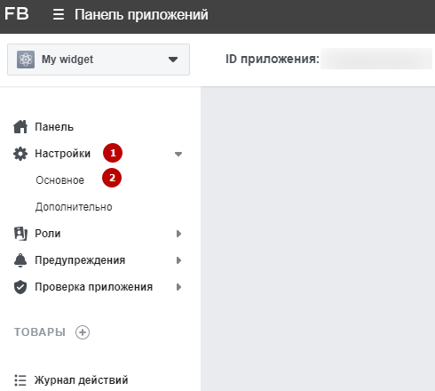

## Лента Instagram ##

### Назначение ###

Позволяет выводить на странице информацию из ленты Instagram подключенного аккаунта (изображение или превью видео, ссылка на пост). Есть возможность управлять информацией через инфоблок: ограничивать вывод постов, изменять изображение, изменять ссылку.

### Принцип действия ###

Раз в заданное время запускается агент, актуализирующий информацию последними N постами путем записи их в инфоблок (если таких еще нет). После добавления поста в инфоблок, он становится неактивным (не выводится в ленте). Для работы нужен API-токен аккаунта Instagram

## Получение API-токена ##

Сначала необходимо создать аккаунт Facebook разработчика. Это можно сделать перейдя по этой ссылке и авторизовавшись. Далее заходим в “Мои приложения”

И жмем “Создать приложение”

В открывшемся попап-окне выберите «Дополнительные параметры».

В следующем окне выберите «Другое».

Укажите название вашего приложения (1). Обратите внимание! Название приложения не должно содержать слово Instagram из-за особенностей работы платформы для разработки. Укажите электронный адрес для связи (2) и выберите аккаунт Business Manager (3). Последнее поле заполнять не обязательно.

Пройдите проверку безопасности.

После этого вас перенаправят на страницу панели нового приложения. В меню выберите Настройки (1) → Основное (2).

Прокрутите открывшуюся страницу до конца и нажмите «Добавить платформу».

В открывшемся окне выберите платформу «Веб-сайт».

В конце страницы появится выбранная платформа «Веб-сайт» и поле для ввода URL-адреса сайта. Заполните его и сохраните изменения.

В меню нажмите на пункт «Товары», найдите карточку Instagram Basic Display и перейдите к ее настройке.

### Настройка продукта ###

После того, как вы перейдете к настройке товара, он станет доступным в левом меню. Разверните пункт Instagram Basic Display и выберите пункт Basic Display.

Внизу страницы нажмите Create New App.

Появится всплывающее окно, в котором будет указано ранее заполненное название приложения. На этом шаге просто сохраните изменения.

После сохранения настроек станут доступны новые поля. В следующих полях укажите адрес сайта, для которого будет настраиваться виджет:

1.Действительные URL переадресации для OAuth.

2.Деавторизация URL обратного вызова.

3.URL запроса на удаление данных.

Сохраните изменения.

### Добавление тестового пользователя ###

В левом меню выберите пункт «Роли» (1), в выпадающем меню — «Роли» (2).

На открывшейся странице в блоке «Тестировщики Instagram» выберите «Добавить Instagram Testers».

В открывшемся окне укажите имя пользователя аккаунта Instagram. После выбора отправьте приглашение пользователю.

Пользователь появится в списке тестировщиков, но со статусом «На рассмотрении». Чтобы подтвердить приглашение, необходимо перейти по ссылке в тексте.

Ссылка ведет на сайт Instagram. Необходимо авторизоваться, чтобы принять приглашение. На открывшейся странице перейдите в «Приложения и сайты» (1) → «Приглашения для тестировщиков» (2). Примите приглашение.

### Генерация API token ###
Разверните пункт Instagram Basic Display (1) и выберите пункт Basic Display (2).

В блоке «Генератор маркеров пользователя» нажмите кнопку Generate Token.

Если вы не авторизованы, войдите в свой профиль Instagram. Разрешите приложению доступ к информации вашего аккаунта.

Затем согласитесь с предупреждением о необходимости передачи токена только доверенным лицам и скопируйте полученный токен.

## Настройка инфраструктуры ##
   Для создания инфоблока необходимо загрузить файл миграции в папку **/reducemigrations/** после чего указать в данном файле нужный тип инфоблока и SITE_ID
   

## Размещение файлов ##
Для того, чтобы получить файлы решения, 
вы можете либо скачать архив в формате ZIP, 
либо при помощи команды **git clone <репозиторий>**

скопировать файлы к себе на локальный компьютер или напрямую на сервер.

   Файлы **Instagram.php** и **InstagramUpdater.php** необходимо разместить в папках **/Helpers/** и **/Agents/** соответственно

   

Папка **/instagram.list/** - шаблон компонента **news.list**

Файл **index.php** - пример вызова компонента
## Настройка агента ##
   В файле агента можно изменить символьные коды инфоблока и полей настроек проекта, либо указать их вручную (если был пропущен шаг по созданию инфраструктуры)
   

После завершения всех настроек, необходимо зарегистрировать агента в системе, для этого переходим в админку сайта в **Настройки -> Настройки проекта -> Агенты -> Добавить агента**

В открывшейся форме нужно указать метод агента: **\WS\Agents\InstagramUpdater::run();**
А также указать время запуска и периодичность (рекомендуется 1 раз в сутки)

После этого переходим в “Настройки проекта” и заполняем необходимые данные (API-токен, кол-во новостей, профиль Instagram, инфоблок Instagram (если не заполнено))

## Настройка компонента ##
   В решении представлена демо-страница с примером вызова компонента вывода ленты Instagram. В нем представлены все необходимые настройки для вывода ленты.
 При необходимости можно изменить кол-во выводимых записей, шаблон, размеры выводимых картинок, а также символьные коды полей настроек проекта (или задать значения вручную)
 
   

Также в решении представлен демо-шаблон, демонстрирующий возможности данного решения:

## Заключение ##

Данное решение позволяет максимально быстро и просто вывести ленту Instagram на страницу, а также управлять ею. Использование инфоблока, позволяет вносить изменения до вывода на сайт, регулировать выводимые записи и их кол-во, вести архив записей. Также, представленная система поддерживает кеширование и кол-во запросов к API минимальное. После установки, вам останется только произвести минимальные настройки и интегрировать верстку, чтобы лента выводилась в стилистике сайта.

